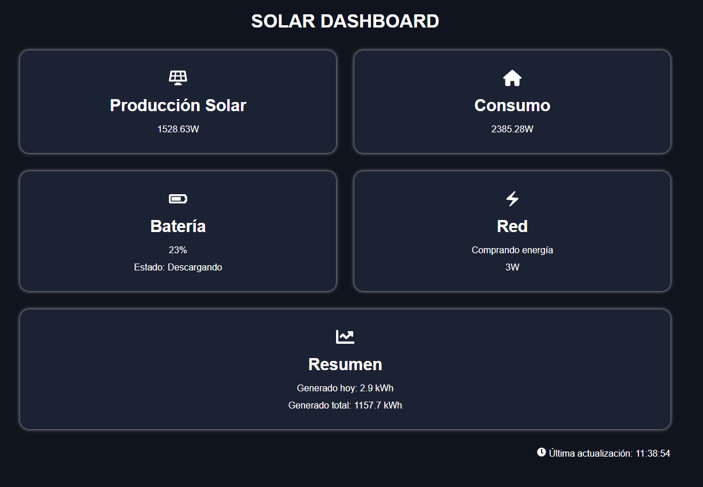

# GoodWe Dashboard

A modern React dashboard for monitoring GoodWe photovoltaic installations.

This application consumes a custom Spring Boot REST API that retrieves and processes data from the GoodWe SEMS Portal.

> **Note:** The backend API is currently private while it is being cleaned up and documented.

---

## Preview



---

## Features

- ☀️ Real-time solar production
- 🏠 Home consumption
- 🔋 Battery status and charge
- ⚡ Grid power monitoring
- 📊 Daily and total generation summary
- 🔄 Automatic dashboard refresh
- 📱 Responsive layout

---

## Tech Stack

- React
- Vite
- Axios
- React Router
- React Icons
- CSS3

---

## Installation

Clone the repository:

```bash
git clone https://github.com/Jacercen/goodwe-dashboard.git
```

Install dependencies:

```bash
npm install
```

Run the application:

```bash
npm run dev
```

---

## Backend

This frontend consumes a custom Spring Boot REST API.

The backend is currently private while it is being refactored and documented before its public release.

---

## Roadmap

- [x] Home dashboard
- [x] Live data refresh
- [x] Responsive cards
- [ ] Statistics page
- [ ] Weather integration
- [ ] Energy savings calculation
- [ ] Raspberry Pi deployment
- [ ] Docker support
- [ ] Plant details page
- [ ] Statistics page
- [ ] Weather integration
- [ ] Energy savings calculation
- [ ] Raspberry Pi deployment
- [ ] Docker support
- [ ] Light/Dark theme

---

